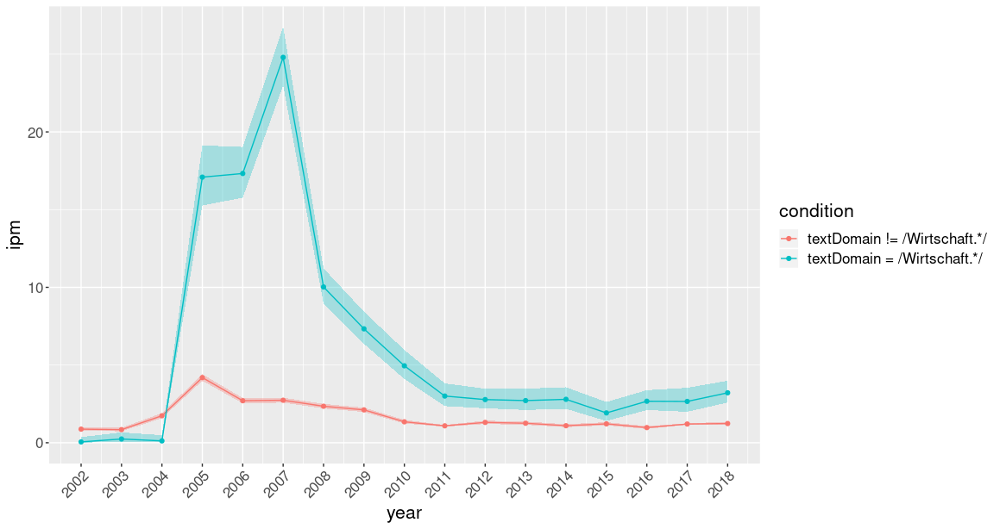
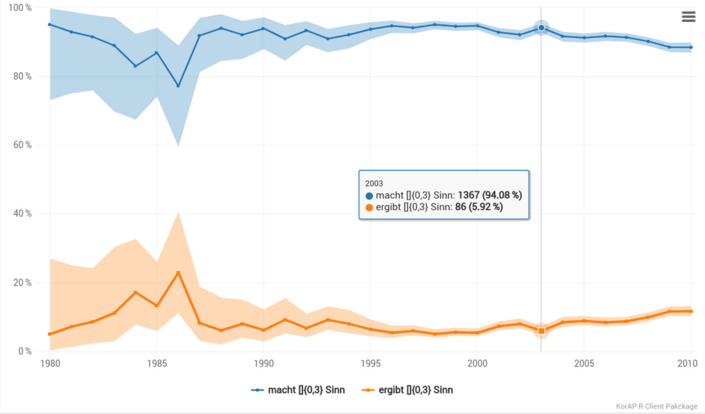

# KorAP web service client package for R <a href="https://korap.ids-mannheim.de/"></a>

[](https://cran.r-project.org/package=RKorAPClient)
[](http://www.r-pkg.org/pkg/RKorAPClient)
[](https://www.repostatus.org/#active)
[](https://www.tidyverse.org/lifecycle/#stable)
[](https://github.com/KorAP/RKorAPClient/actions)
[](https://codecov.io/gh/KorAP/RKorAPClient?branch=master)
[](https://github.com/KorAP/RKorAPClient/issues)
[](https://github.com/KorAP/RKorAPClient/issues)
[](https://github.com/KorAP/RKorAPClient/issues)
[](https://github.com/KorAP/RKorAPClient)

## Description

R client package to access the [web service API](https://github.com/KorAP/Kustvakt/wiki) of the [KorAP Corpus Analysis Platform](https://korap.ids-mannheim.de/) developed at [IDS Mannheim](http://www.ids-mannheim.de/)

## Examples

### Hello world

```R
library(RKorAPClient)
KorAPConnection(verbose=TRUE) |> corpusQuery("Hello world") |> fetchAll()
```

### Verbose output without changing code

You can turn on verbose logging globally without changing calls by setting an environment variable (or an R option):

```r
# Environment variable (recommended for sessions / ~/.Renviron)
Sys.setenv(KORAP_VERBOSE = "true")
KorAPConnection()  # uses verbose = TRUE

# Alternatively, R option
options(rkorap.verbose = TRUE)
KorAPConnection()
```
Explicit `verbose` arguments still take precedence over these settings.

### Frequencies over time and domains using ggplot2

```r
library(RKorAPClient)
library(ggplot2)
kco <- KorAPConnection(verbose=TRUE)
expand_grid(condition = c("textDomain = /Wirtschaft.*/", "textDomain != /Wirtschaft.*/"), 
            year = (2002:2018)) %>%
    cbind(frequencyQuery(kco, "[tt/l=Heuschrecke]", paste0(.$condition," & creationDate in ", .$year)))  %>%
    ipm() %>%
    ggplot(aes(x = year, y = ipm, fill = condition, colour = condition)) +
    geom_freq_by_year_ci()
```
<!-- -->

`frequencyQuery` returns a data frame with raw frequencies (in `totalResults`), relative frequencies (in `f`), and confidence intervals.

### Percentages over time using [highcharter](http://jkunst.com/highcharter/)

See the [Highcharts license notes](#highcharts) below.

```r
library(RKorAPClient)
query = c("macht []{0,3} Sinn", "ergibt []{0,3} Sinn")
years = c(1980:2010)
as.alternatives = TRUE
vc = "textType = /Zeit.*/ & creationDate in"
KorAPConnection(verbose=T) |>
  frequencyQuery(query, paste(vc, years), as.alternatives = as.alternatives) |>
  hc_freq_by_year_ci(as.alternatives)
```

[<!-- -->](https://korap.github.io/RKorAPClient/man/figures/Readme-Example-2.html)

### Use other corpora than DeReKo as basis

Set the first (`KorAPUrl`) argument of the `KorAPConnection` function to the URL of the KorAP instance, providing the desired corpus, e.g. to 

* `https://korap.ids-mannheim.de/instance/wiki/` for the current German Wikipedia corpus provided by the IDS
* `https://korap.ids-mannheim.de/instance/english/` for an English Wikipedia corpus provided by the IDS
* `https://korap.dnb.de/` for the DeLiKo@DNB-XL German fiction corpus
* `https://korap.racai.ro/` for the Contemporary Corpus of the Romanian Language (CoRoLa)

```r
library(RKorAPClient)
KorAPConnection(KorAPUrl = "https://korap.ids-mannheim.de/instance/wiki/", verbose = TRUE) |>
  corpusQuery("Berlin") |>
  fetchAll()
```
  
### Identify *in … setzen* light verb constructions by using the new `collocationAnalysis` function

```r
library(RKorAPClient)
library(knitr)
KorAPConnection(verbose = TRUE) |> auth() |>
  collocationAnalysis(
    "focus(in [tt/p=NN] {[tt/l=setzen]})",
    leftContextSize = 1,
    rightContextSize = 0,
    exactFrequencies = FALSE,
    searchHitsSampleLimit = 1000,
    topCollocatesLimit = 20
  ) |>
  mutate(LVC = sprintf("[in %s setzen](%s)", collocate, webUIRequestUrl)) |>
  select(LVC, logDice, pmi, ll) |>
  head(10) |>
  kable(format="pipe", digits=2)
```

The focus, here, with the `[tt/l=setzen]` in braces, makes sure that the left context size parameter 1 is understood relative to the lemma `setzen`. 
The `[tt/p=NN]` in the focus query makes sure that only nouns (at this position) are considered as collocates.
To perform a simple collocation analysis for a word form, rather then a lemma and without restriction to light verb constructions, simply use, for instance, `KorAPConnection(verbose = TRUE) |> auth() |> collocationAnalysis("setzts")`.


|LVC                                                                                                                                                                  | logDice|   pmi|        ll|
|:--------------------------------------------------------------------------------------------------------------------------------------------------------------------|-------:|-----:|---------:|
|[in Szene setzen](https://korap.ids-mannheim.de/?q=Szene%20focus%28in%20%5btt%2fp%3dNN%5d%20%7b%5btt%2fl%3dsetzen%5d%7d%29&ql=poliqarp)                              |    9.66| 10.86| 465467.52|
|[in Gang setzen](https://korap.ids-mannheim.de/?q=Gang%20focus%28in%20%5btt%2fp%3dNN%5d%20%7b%5btt%2fl%3dsetzen%5d%7d%29&ql=poliqarp)                                |    9.21| 10.57| 256146.92|
|[in Verbindung setzen](https://korap.ids-mannheim.de/?q=Verbindung%20focus%28in%20%5btt%2fp%3dNN%5d%20%7b%5btt%2fl%3dsetzen%5d%7d%29&ql=poliqarp)                    |    8.46|  9.62| 189682.19|
|[in Kenntnis setzen](https://korap.ids-mannheim.de/?q=Kenntnis%20focus%28in%20%5btt%2fp%3dNN%5d%20%7b%5btt%2fl%3dsetzen%5d%7d%29&ql=poliqarp)                        |    8.28|  9.81| 101112.02|
|[in Bewegung setzen](https://korap.ids-mannheim.de/?q=Bewegung%20focus%28in%20%5btt%2fp%3dNN%5d%20%7b%5btt%2fl%3dsetzen%5d%7d%29&ql=poliqarp)                        |    8.11|  9.24| 149397.91|
|[in Brand setzen](https://korap.ids-mannheim.de/?q=Brand%20focus%28in%20%5btt%2fp%3dNN%5d%20%7b%5btt%2fl%3dsetzen%5d%7d%29&ql=poliqarp)                              |    8.10|  9.33| 122427.05|
|[in Anführungszeichen setzen](https://korap.ids-mannheim.de/?q=Anf%c3%bchrungszeichen%20focus%28in%20%5btt%2fp%3dNN%5d%20%7b%5btt%2fl%3dsetzen%5d%7d%29&ql=poliqarp) |    7.50| 11.96|  33959.99|
|[in Kraft setzen](https://korap.ids-mannheim.de/?q=Kraft%20focus%28in%20%5btt%2fp%3dNN%5d%20%7b%5btt%2fl%3dsetzen%5d%7d%29&ql=poliqarp)                              |    6.88|  7.88|  77796.85|
|[in Marsch setzen](https://korap.ids-mannheim.de/?q=Marsch%20focus%28in%20%5btt%2fp%3dNN%5d%20%7b%5btt%2fl%3dsetzen%5d%7d%29&ql=poliqarp)                            |    6.87|  9.27|  22041.63|
|[in Klammern setzen](https://korap.ids-mannheim.de/?q=Klammern%20focus%28in%20%5btt%2fp%3dNN%5d%20%7b%5btt%2fl%3dsetzen%5d%7d%29&ql=poliqarp)                        |    6.55| 10.08|  15643.27|

### <a name="authorization"></a> Authorizing RKorAPClient applications to access restricted KWICs from copyrighted texts

In order to perform collocation analysis and other textual queries on corpus parts for which KWIC access requires a login, you need to authorize your application with an access token.

In the case of DeReKo, this can be done in three different ways.

#### 1. The latest and laziest way (available since RKorAPClient 0.9.0.9000)

Authorize your RKorAPClient application via the usual OAuth browser flow *using the default application id* and the `auth` method:

```R
kco <- KorAPConnection() |> auth()
```

#### 2. The old way: Authorize your RKorAPClient application manually
(Required for headless operation, e.g. in batch scripts)

1. Log in into the [KorAP DeReKo instance](https://korap.ids-mannheim.de/)
1. Open the [KorAP OAuth settings](https://korap.ids-mannheim.de/settings/oauth#page-top)
1. If you have not yet registered a client application, or not the desired one, register one (it is sufficient to fill in the marked fields).
1. Click the intended client application name.
1. If you do not have any access tokens yet, click on the "Issue new token" button.
1. Copy one of your access tokens to you clipboard by clicking on the copy symbol ⎘ behind it.
1. In R/RStudio, paste the token into your KorAPConnection initialization, overwriting `<access token>` in the following example:

   ```R
   kco <- KorAPConnection(accessToken="<access token>")
   ```

The whole process is shown in this video:

https://user-images.githubusercontent.com/11092081/142769056-b389649b-eac4-435f-ac6d-1715474a5605.mp4

#### 3. The new way (available since RKorAPClient 0.9.0.9000)

Authorize your RKorAPClient application via the usual OAuth browser flow, using *your own application id* and the `auth` method:

1. Follow steps 1-4 of the old way shown above.
2. Click on the copy symbol ⎘ behind the ID of your client application.
3. Paste your clipboard content overwriting `<application ID>` in the following example code:
   ```R
   kco <- KorAPConnection() |> auth(app_id = "<application ID>")
   ```

#### Storing and testing your authorized access

(Not recommended for the default application id, as it is not secure.)

You can also persist the access token for subsequent sessions with the `persistAccessToken` function:

```R
persistAccessToken(kco)
```

Afterwards a simple `kco <- KorAPConnection()` will retrieve the stored token. 
Piping the result through the `auth()` function `kco <- KorAPConnection() |> auth()` works and does nothing, in this case.

To use the access token for simple corpus queries, i.e. to make `corpusQuery` return KWIC snippets, the `metadataOnly` parameter must be set to `FALSE`, for example:

```R
corpusQuery(kco, "Ameisenplage", metadataOnly = FALSE) |> fetchAll()
```

should return KWIC snippets, if you have authorized your application successfully.

## Querying and fetching annotations

You can use complex annotation queries in all client functions just as in the KorAP web interface (see [KorAP Query Help](https://korap.ids-mannheim.de/doc/ql)). To fetch the annotations for all matches in a `KorAPQuery` object, use the `fetchAnnotations()` method:

```R
# fetchAnnotations is currently only available in the development version of RKorAPClient
devtools::install_github("KorAP/RKorAPClient")
library(RKorAPClient)
kco <- KorAPConnection(verbose = TRUE) |> auth()
q <- corpusQuery(kco, "[marmot/p=ADJA] [tt/l=Ameisenplage & marmot/m=case:acc]", metadataOnly = FALSE) |>
  fetchAll() |>
  fetchAnnotations(foundry = "marmot")

View(cbind(q@collectedMatches[c("textSigle", "snippet")], 
           pos = q@collectedMatches$pos, 
           morph = q@collectedMatches$morph))
```

The annotations are stored in `q@collectedMatches$pos`, `q@collectedMatches$morph`, and `q@collectedMatches$lemma` (for foundries that contain lemma annotations, like `tt`, but not `marmot`).

Small workflows you may find useful:

```r
# 1) Add TT (POS/lemma), then add MarMoT (morph) without overwriting
q <- corpusQuery(kco, "Ameisenplage", metadataOnly = FALSE) |>
  fetchAll() |>
  fetchAnnotations(foundry = "tt") |>
  fetchAnnotations(foundry = "marmot")  # keeps TT POS/lemma, adds morph

# 2) Force re-fetch to repair damaged annotations
q <- fetchAnnotations(q, foundry = "tt", overwrite = TRUE)
```

**Tip**: If you don't know any of the provided query languages or the tag sets, you can use KorAP's *query by example* (or rather *query by match*) feature by searching for a concrete example of the construction you are interested in, and then constructing your complex annotation query by just clicking on the entries in the tokens annotations of the query results, as demonstrated in this [video](https://corpora.ids-mannheim.de/slides/2024-04-24-Current-Challenges/autant-que-je-sache.mp4) (see also Diewald/Barbu Mititelu/Kupietz 2019).

## Demos

More elaborate R scripts demonstrating the use of the package can be found in the [demo](demo) folder.

## Installation

### Install R and RStudio

1. Install latest R version for your OS, following the instructions from [CRAN](https://cran.r-project.org/bin/)
2. Download and install latest RStudio Desktop from [RStudio downloads](https://www.rstudio.com/products/rstudio/download/#download)


### Install the RKorAPClient package

#### Linux only: Install system dependencies

```bash
# Debian, Ubuntu, ...
sudo apt -f install # install possibly missing RStudio dependencies
sudo apt install r-base-dev r-cran-rcpp r-cran-cpp11 libcurl4-gnutls-dev libxml2-dev libsodium-dev libsecret-1-dev libfontconfig1-dev libssl-dev libv8-dev

# Fedora, CentOS, RHEL, Rocky Linux, AlmaLinux, ...
sudo dnf install R-devel libcurl-devel openssl-devel libxml2-devel libsodium-devel libsecret-devel fontconfig-devel v8-devel

# Arch Linux
pacman -S base-devel gcc-fortran libsodium curl
```

#### In RStudio

Start RStudio and click on *Install Packages…* in the *Tools* menu. Enter *RKorAPClient* in the *Packages* input field and click on the *Install* button (keeping *Install Dependencies* checked).

[<!-- -->](https://korap.github.io/RKorAPClient/man/figures/RKorAPClient-RStudio-install.mp4)

If the installation fails for some reason, you might need to update your installed R packages first (Tools -> Check for Package Updates, Select All, Install Updates).


#### Or from the command line

Start R, then install RKorAPClient from CRAN (or development version from GitHub or KorAP's gerrit server).

##### CRAN version:

```r
install.packages("RKorAPClient")
```

##### Development version:

```r
remotes::install_github("KorAP/RKorAPClient")
```

## Full installation videos

## Mac

https://user-images.githubusercontent.com/11092081/142773435-ea7ef92a-7ea4-4c6d-a252-950e486352f2.mp4

## Ubuntu

https://user-images.githubusercontent.com/11092081/142772382-1354b8db-551f-48de-a416-4fd59267662d.mp4

## Development and License
### RKorAPClient

**Authors**: [Marc Kupietz](https://www.ids-mannheim.de/digspra/personal/kupietz/), [Nils Diewald](https://www.ids-mannheim.de/digspra/personal/diewald/)

Copyright (c) 2025, [Leibniz Institute for the German Language](http://www.ids-mannheim.de/), Mannheim, Germany

This package is developed as part of the [KorAP](http://korap.ids-mannheim.de/)
Corpus Analysis Platform at the Leibniz Institute for German Language
([IDS](http://www.ids-mannheim.de/)).

It is published under the
[BSD-2 License](LICENSE.md).

### Further Affected Licenses and Terms of Services

#### Bundled Assets

The KorAP logo was designed by Norbert Cußler-Volz and
is released under the terms of the Creative Commons
License BY-NC-ND 4.0.

#### Highcharts

RKorAPClient imports parts of the [highcharter package](https://cran.r-project.org/package=highcharter) which has a dependency on Highcharts, a commercial JavaScript charting library. Highcharts offers both a commercial license as well as a free non-commercial license. Please review the licensing options and terms before using the highcharter plot options, as the `RKorAPClient` license neither provides nor implies a license for Highcharts.

[Highcharts](http://highcharts.com) is a Highsoft product which is not free for commercial and governmental use.

### Accessed API Services

By using RKorAPClient you agree to the respective terms of use of the accessed KorAP API services which will be printed upon opening a connection (`KorAPConnection(...`).

## Contributions

Contributions are very welcome!

Your contributions should ideally be committed via our [Gerrit server](https://korap.ids-mannheim.de/gerrit/)
to facilitate reviewing (see [Gerrit Code Review - A Quick Introduction](https://korap.ids-mannheim.de/gerrit/Documentation/intro-quick.html)
if you are not familiar with Gerrit). However, we are also happy to accept comments and pull requests
via GitHub.

Please note that unless you explicitly state otherwise any
contribution intentionally submitted for inclusion into this software shall –
as this software itself – be under the [BSD-2 License](LICENSE.md).

## References

- Diewald, Nils/Barbu Mititelu, Verginica/Kupietz, Marc (2019): The KorAP user interface. Accessing CoRoLa via KorAP. In: On design, creation and use of the Reference Corpus of Contemporary Romanian and its analysis tools. CoRoLa, KorAP, DRuKoLA and EuReCo. Edited by Ruxandra Cosma/Marc Kupietz, 64(3). <https://nbn-resolving.org/urn:nbn:de:bsz:mh39-93866>.

* Kupietz, Marc / Margaretha, Eliza / Diewald, Nils / Lüngen, Harald / Fankhauser, Peter (2019): [What’s New in EuReCo? Interoperability, Comparable Corpora, Licensing](https://nbn-resolving.org/urn:nbn:de:bsz:mh39-90261). In: Bański, Piotr/Barbaresi, Adrien/Biber, Hanno/Breiteneder, Evelyn/Clematide, Simon/Kupietz, Marc/Lüngen, Harald/Iliadi, Caroline (eds.): [*Proceedings of the International Corpus Linguistics Conference 2019 Workshop "Challenges in the Management of Large Corpora (CMLC-7)"*](https://ids-pub.bsz-bw.de/solrsearch/index/search/searchtype/collection/id/21038), 22nd of July Mannheim: Leibniz-Institut für Deutsche Sprache, 33-39.

* Kupietz, Marc / Diewald, Nils / Margaretha, Eliza (2020): [RKorAPClient: An R package for accessing the German Reference Corpus DeReKo via KorAP](http://www.lrec-conf.org/proceedings/lrec2020/pdf/2020.lrec-1.867.pdf). In: Calzolari, Nicoletta, Frédéric Béchet, Philippe Blache, Khalid Choukri, Christopher Cieri,  Thierry Declerck, Sara Goggi, Hitoshi Isahara, Bente Maegaard, Joseph Mariani, Hélène Mazo, Asuncion Moreno, Jan Odijk, Stelios Piperidis (eds.): [Proceedings of The 12th Language Resources and Evaluation Conference (LREC 2020)](http://www.lrec-conf.org/proceedings/lrec2020/LREC-2020.pdf). Marseille: European Language Resources Association (ELRA), 7017-7023.

* Kupietz, Marc/Diewald, Nils/Margaretha, Eliza (2022): Building paths to corpus data: A multi-level least effort and maximum return approach. In: Fišer, Darja/Witt, Andreas (eds.): CLARIN. The Infrastructure for Language Resources. Berlin: deGruyter, pp. 163–189. <https://doi.org/10.1515/9783110767377-007>.
